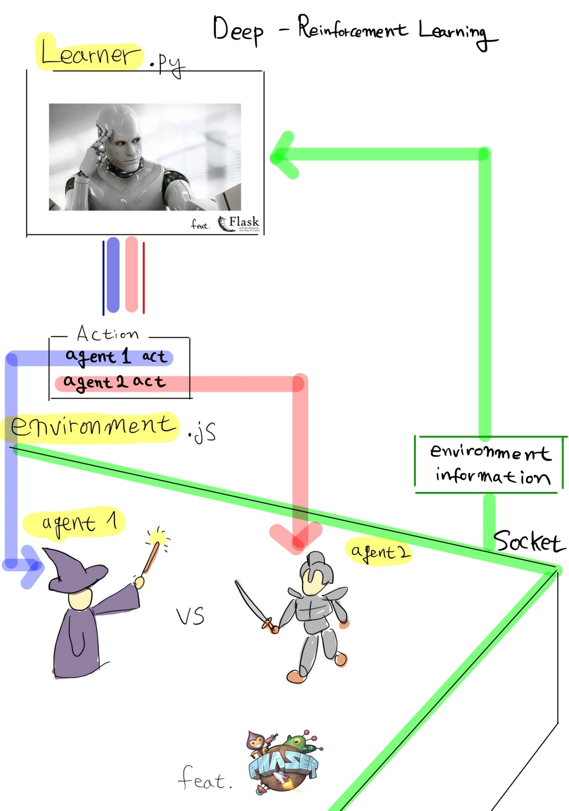

# Reinforcement-Learning implementation on PhaserJS

## Dependencies
1. Flask
2. flask-socketio
3. your own Neural-Network library (if needed)
  
## Big Picture

  
## How to Run
    $ python ./Learner.py
    $ to test game, use https://chrome.google.com/webstore/detail/web-server-for-chrome/ofhbbkphhbklhfoeikjpcbhemlocgigb and set folder with /templates_test

  

## How to train
1. open Action.py 
2. maniplulate **action function** with your own RL algorithm
3. regarding **action function** you receive reward and state and should return action
  

## Environment

## Reinforcement-Learning
### MDP
=R(s)+\gamma\sum_{s^\prime\in{S}}P_{s\pi(s)}(s^\prime)V^\pi(s^\prime))
